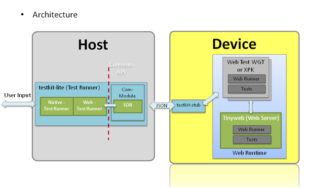
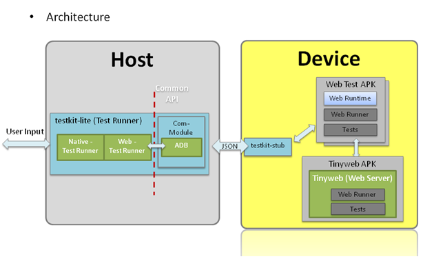

# Web Runtime Test Suite User Guide

#1. Introduction

This document provides method to run WRT TestSuite on TIZEN and Android Crosswalk. You can use the following method to run itwith testkit-lite. Testkit tool-chain includes 3 components:

- testkit-lite:  a command-line interface application deployed on Host
- testkit-stub: a test stub application deployed on Device
- tinyweb:   a web service application deployed on Device

#2. Web Testing Architecture

- Web Testing on Tizen

- Web Testing on Android

There are two types of Webapi tests:

- Web service dependent

Client side is a stub test package which link to remote web runner, no local TCs and web runner, thus avoid cross origin issue.

Server side include tinyweb, webrunner and TCs.

- Web service independent

Self contained test package which include all things - web runner, TCs.

#3. Install testkit-lite on Host

- Deploy testkit-lite

 - Install dependency python-requests (version>1.0)

        $ sudo apt-get install python-pip

        $ sudo pip install requests

 - Install testkit-lite from source code in GitHub

        $ git clone [git@github.com:testkit/testkit-lite.git](mailto:git@github.com:testkit/testkit-lite.git)

        $ cd testkit-lite && sudo python setup.py install

#4. WRT Test on Tizen Crosswalk

- Download sdb tool and deploy it to Host

  - Download link and manual link of sdb  [http://download.tizen.org/sdk/latest/tizen/binary/sdb\\_<version\\>\\_<host\\>.zip](http://download.tizen.org/sdk/latest/tizen/binary/sdb_%3cversion%3e_%3chost%3e.zip)  [https://developer.tizen.org/dev-guide/2.2.1/org.tizen.gettingstarted/html/dev\_env/smart\_development\_bridge.htm](https://developer.tizen.org/dev-guide/2.2.1/org.tizen.gettingstarted/html/dev_env/smart_development_bridge.htm)

  - Deploy sdb to Host

        $ unzip sdb\_<version\>\_<host\>.zip

        $ sudo cp data/tools/sdb /usr/bin/sdb

        $ sudo chmod +x /usr/bin/sdb

- Preparation for Tizen device

  - Set Tizen device to root mode

        $ sdb root on

  - Make a tct folder

        $ sdb shell "mkdir -p /opt/usr/media/tct/"

        $ sdb shell "chmod 777 /opt/usr/media/tct/"

- Install crosswalk on Tizen device

  - Download crosswalk from here  [https://download.01.org/crosswalk/releases/crosswalk/tizen-ivi/canary//crosswalk-.i686.rpm](https://download.01.org/crosswalk/releases/crosswalk/tizen-ivi/canary//crosswalk-.i686.rpm)
  [https://download.01.org/crosswalk/releases/tizen-extensions-crosswalk/tizen-ivi/canary//tizen-extensions-crosswalk-.i686.rpm](https://download.01.org/crosswalk/releases/tizen-extensions-crosswalk/tizen-ivi/canary//tizen-extensions-crosswalk-.i686.rpm)

  - Deploy crosswalk to Tizen device

        $ sdb push crosswalk-<version\>.i686.rpm /opt/home/developer

        $ sdb push tizen-extensions-crosswalk-<version\>.i686.rpm /opt/home/developer

        $ sdb shell "rpm -ivh /opt/home/developer/crosswalk-<version\>.i686.rpm"

        $ sdb shell "rpm -ivh /opt/home/developer/tizen-extensions-crosswalk-<version\>.i686.rpm"

- Deploy testkit-stub and launch it

  - Make binary for testkit-stub from source code in GitHub

        $ git clone git@github.com:testkit/testkit-stub.git

        $ cd testkit-stub && make

        Note: The generated testkit-stub type depends on your OS system type (32/64 bit).

  - Deploy binary to Tizen device

        $ sdb push testkit-stub /opt/home/developer

        $ sdb shell "chmod +x /opt/home/developer/testkit-stub"

  - Launch testkit-stub

        $ sdb shell "/opt/home/developer/testkit-stub --port:8000"

- Deploy tinyweb and launch it

  - Make binaries for tinyweb from source code in Github

        $ git clone git@github.com:testkit/tinyweb.git

        $ cd tinyweb && make

        Note: The generated tinyweb type depends on your OS system type (32/64 bit).

  - Deploy binaries to Tizen device

        $ sdb push tinyweb /opt/home/developer/

        $ sdb shell "chmod a+x /opt/home/developer/tinyweb"

        $ sdb push cgi-getcookie /opt/home/developer/

        $ sdb shell "chmod a+x /opt/home/developer/cgi-getcookie" 

        $ sdb push cgi-getfield /opt/home/developer/

        $ sdb shell "chmod a+x /opt/home/developer/cgi-getfield"

        $ sdb push server.pem /opt/home/developer/

        $ sdb shell "chmod 666 /opt/home/developer/server.pem"

        $ sdb shell "ln -s /usr/lib/libssl.so.1.0.0 /opt/home/developer/libssl.so"

        $ sdb shell "ln -s /usr/lib/libcrypto.so.1.0.0 /opt/home/developer/libcrypto.so"

  - Launch tinyweb

        $ DPATH=`sdb shell "printenv PATH"`

        $ timeout 5 sdb shell "env LD\_LIBRARY\_PATH=/opt/home/developer PATH=$DPATH:/opt/home/developer tinyweb -ssl\_certificate /opt/home/developer/server.pem -document\_root /opt/usr/media/tct/ -listening\_ports 80,8080,8081,8082,8083,8443s; sleep 3s"

- Pack test suite package

    Please see **Web\_Test\_Suite\_Packaging\_Guide** , Chapter 3.3 "_Pack Web Test Suite Packages for Tizen IVI_", to choose suitable mode package for Tizen device.

- Install test suite on Tizen device

    $ sdb push <test_suite_name\>-<version\>.xpk.zip /opt/usr/media/tct

    $ sdb shell unzip -o /opt/usr/media/tct/<test_suite_name\>-<version\>.xpk.zip -d /opt/usr/media/tct

    $ sdb shell /opt/usr/media/tct/opt/<test_suite_name\>/inst.sh

- Launch WRT test with lite

    $ testkit-lite -f device:/opt/usr/media/tct/opt/<test_suite_name\>/tests.xml

- Uninstall test suite

    $ sdb shell /opt/usr/media/tct/opt/<test_suite_name\>/inst.sh -u

#5. WRT Test on Android Crosswalk

- Deploy Android ADT bundle (Android SDK, IDE included) and Android NDK

  - DeployAndroid ADT bundle by referring to link below  [http://developer.android.com/sdk/installing/bundle.html](http://developer.android.com/sdk/installing/bundle.html)

  - Deploy Android NDK by referring to link below  [http://developer.android.com/tools/sdk/ndk/index.html](http://developer.android.com/tools/sdk/ndk/index.html)

- Deploy adb Tool to Host

  - Append Android SDK's tools and platform-tools directories to PATH environment

        $ export PATH=${PATH}:/path/to/adt-bundle-/sdk/tools: /path/to/adt-bundle-/sdk/platform-tools

- Install crosswalk on Android device

  - Download crosswalk from here  https://download.01.org/crosswalk/releases/crosswalk/android/canary/<version\>/x86/crosswalk-apks-<version\>-x86.

  - Deploy crosswalk to Android device

        $ unzip crosswalk-apks-<version\>-x86.zip -d /path/to/

        $ adb install /path/to/crosswalk-apks-<version\>-x86/XWalkRuntimeLib.apk

- Deploy testkit-stub and launch it

  - Make binary for testkit-stub from source code in GitHub

        $ git clone git@github.com:testkit/testkit-stub.git

        $ cd testkit-stub/android/jni/ && /path/to/android-ndk-/ndk-build

  - Import project testkit-stub to Android developer Tool by location testkit-stub/android
  - Export the android project to APK and install APK to android device

        $ adb install /path/to/TestkitStub.apk

  - Launch testkit-stub by clicking the testkit-stub App icon in launcher

- Deploy tinyweb and launch it

  - Make binaries for tinyweb from source code in GitHub

        $ git clone git@github.com:testkit/tinyweb.git

        $ cd tinyweb/android/native/jni/ && /path/to/ android-ndk-/ndk-build

  - Copy tinyweb/android/native/libs/ to folder tinyweb/android/assets/system/libs/

        For example:

        $ cp -r /path/to/tinyweb/android/native/libs/ /path/to/tinyweb/android/assets/system/libs/

  - Import project tinyweb to Android developer Tool by location tinyweb /android
  - Export the android project to APK and install APK to android device

        $ adb install /path/to/TinywebTestService.apk

  - Launch tinyweb by clicking the tinyweb app icon in launcher

- Pack test suite package

    Please see **Web\_Test\_Suite\_Packaging\_Guide** , Chapter 3.1 "_Pack Web Test Suite Packages for Android_".

    Note: For Android device, only embedded mode APK package is supported.

- Install test suite on Android device

    $ unzip -o <test\_suite\_name\>-<version\>.apk.zip -d /path/to/

    $ /path/to/opt/<test\_suite\_name\>/inst.sh

- Launch WRT test with lite

    $ testkit-lite -f /path/to/opt/<test\_suite\_name\>/tests.xml --comm androidmobile

- Uninstall test suite

    $ /path/to/opt/<test\_suite\_name\>/inst.sh -u
