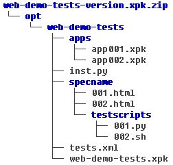
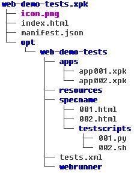

# Web Test Suite Packaging Guide

## Overview
This document is intended for developers or testers who need to pack Crosswalk web test suites. Crosswalk web test suites support pack on multiple platforms including Android, Windows, Linux, IOS. 

You are supposed to have gained the following knowledge before read this guide:

- Where and how to download web test source code files.
- How to download and install android SDK.

## Environment Setup 

### Set packaging environment for Android and Linux:
An Ubuntu (12.04) host is needed to pack the web test suites for Android and Linux.

- Install python-dev (2.7 or above):
	
        $ sudo apt-get install python-dev

- Install npm nodejs:
	
        $ sudo apt-get install npm nodejs

- Install app-tools

        $ sudo npm install -g crosswalk-app-tools 

- Download and install Android SDK(>=android-19) for your platform from <http://developer.android.com/sdk/index.html>.
- Deploy Android SDK`s tools and platform-tools to PATH environment

        $ export PATH=$PATH:/path/to/adt-bundle-<version>/sdk/platform-tools:/path/to/adb-bundle-/sdk/platform-tools

- Install ant maven (for android)

        $ sudo apt-get install ant maven

- Set a environment variable named CROSSWALK_APP_TOOLS_CACHE_DIR:

        $ export CROSSWALK_APP_TOOLS_CACHE_DIR=/custom/your/environment/path/

- Get proper package of `<version>/crosswalk-<version>.zip` from <https://download.01.org/crosswalk/releases/crosswalk/android/canary/>. 
    
        $ mv crosswalk-<version>.zip $CROSSWALK_APP_TOOLS_CACHE_DIR

Besides app-tools, cordova tool is also support to build Web Apps for Android. 

- if build with cordova, Get proper package of `<version>/<arch>/crosswalk-cordova-<version>-<arch>.zip` from <https://download.01.org/crosswalk/releases/crosswalk/android/canary/>.

        $ cd /path/to/crosswalk-test-suite/tools/
        $ unzip /path/to/crosswalk-cordova-<version\>-<arch\>.zip
        $ mv crosswalk-cordova-<version\>-<arch\> cordova

### Set packaging environment for Windows:

An Windows (8.1 or 10) host is needed to pack the web test suites.

- Download and Install [python](https://www.python.org/downloads/).
- Deploy python-tools to PATH environment in Advanced system settings/envirnemnt variables.
- Download and Install [nodejs](https://nodejs.org/en/)
- Deploy nodejs tool to PATH environment in Advanced system settings/envirnemnt variables.
- Download and Install [WiX Toolset](http://wixtoolset.org/)
- Deploy WiX toolset to PATH environment in Advanced system settings/envirnemnt variables

- Install app-tools

        $ npm install -g crosswalk-app-tools

- Set a environment variable named CROSSWALK_APP_TOOLS_CACHE_DIR in Advanced system settings/envirnemnt variablels.
- Get proper package of `<version>/crosswalk-<version>.zip` from <https://download.01.org/crosswalk/releases/crosswalk/android/canary/>. and move crosswalk-<version>.zip to $CROSSWALK_APP_TOOLS_CACHE_DIR

## `pack.py`
`pack.py` script in crosswalk-test-suite/tools/build, is a centralized pack solution for crosswalk test suites on different platforms. it integrate various pack tools as build backend, include: crosswalk app-tools build for android, windows, linux, cordova build for android, ant/maven/gradle build for android, IOS build. 

```
Usage: ./pack.py -t apk -m shared -a x86

Options:
  -h, --help            show this help message and exit
  -c PKGCFG, --cfg=PKGCFG
                        specify the path of config json file
  -t PKGTYPE, --type=PKGTYPE
                        specify the pkg type, e.g. apk, xpk, wgt ...
  -m PKGMODE, --mode=PKGMODE
                        specify the apk mode, e.g. shared, embedded
  -a PKGARCH, --arch=PKGARCH
                        specify the apk arch, e.g. x86, arm
  -d DESTDIR, --dest=DESTDIR
                        specify the installation folder for packed package
  -s SRCDIR, --src=SRCDIR
                        specify the path of pkg resource for packing
  --tools=PKGPACKTOOLS  specify the parent folder of pack tools
  --notclean            disable the build root clean after the packing
  -v, --version         show this tool's version
  --pkg-version=PKGVERSION
                        specify the pkg version, e.g. 0.0.0.1
```

With this script, you could :
- Not maintain Makefile.am for every subdirectory.
- Not maintain autoconf since it is hard to build resource on multiple platforms.
- Share one pack tool (pack.py) for all test suites; maintain a specific JSON file (suite.json) for resource structure in each suite.
- Share one VERSION file at the top directory.
- Use scalable options for tools/install destination/package source/packing debug ...
- Get good experience with multiple packing processes and informational logs.
- Strict the error handling.

## Package Resources 
Here is a typical Crosswalk test suite resource structure:


### suite.json
| Key | Mandatory? | Description | Example | Note |
|:----|:-----------|:-----------|:--------|:-----|
| "pkg-name" | No | Package name | `"pkg-name": "web-demo-tests"` |
| "pkg-blacklist" | No | The common black list used by final zip package and top level package app | `"pkg-blacklist":["pack.py", "COPYING"]` | `pack.py` will handle some app framework files by itself, e.g. `icon.png`, `config.xml`, so you just need add those files to this common black list. The value of the list member can support "regular expression", e.g. `test/*.py` will add all files which have `.py` suffix in `test` folder to the black list. |
| "pkg-list" | Yes | The detailed package type which the `pack.py` supported | | The package should be the one of `apk`, `xpk`, `wgt`, `apk-aio`, `cordova`. The package type can share a package json section, e.g. `apk,cordova`, or use single section, e.g. `wgt` |
| "blacklist" | No | The black list used by the parent package or app | `"blacklist":["specname/testapps","specname/testscripts"]` | Effective on relative path， e.g. package's `blacklist` acts on suite folder(in final zip package, is `/`), and package top level app's `blacklist` acts on suite folder(in final zip package, is `/opt/test-suite-name/` folder). But for sub apps' `blacklist`, it act on sub apps source folder(in sub app package, is `/`). The value of the list member can support "regular expression", e.g. `test/*.py` will add all files which have `.py` suffix in `test` folder to the black list. |
| "copylist"  | No | The copy list used by the parent package or app | `"copylist": {"inst.apk.py": "inst.py","specname/testscripts": "specname/testscripts","specname/testscripts/app01/webdriver.xw_android.cfg": "specname/testscripts/app01/webdriver.cfg"} `| Effective on relative path too, just like `blacklist`, but not support "regular expression". Support MARCO `PACK-TOOL-ROOT` to replace the prefix of "relative path", the `PACK-TOOL-ROOT` is the tools path (point out by `--tools` or default `test-suite-name/../../tools`, e.g. `"PACK-TOOL-ROOT/crosswalk/":"crosswalk"` will copy crosswalk folder under tools to `crosswalk` folder of the package/app source tree) |
| "pkg-app" | No | The package's top level app | | Only some WebAPI test packages need this top level app |
| "subapp-list" | No | The black list used by the parent package or app| | The key of the number should be the app's relative path in suite source folder |
| "app-dir" | No | Specify which directory will be packed as a sub app | `"app-dir": "path/to/folder"` | The sub-app will use the key in `subapp-list` if no `app-dir` provided in json by default |
| "app-name" | No | Sub app name | `app01` | The app will use the parent folder name if no `app-name` provided in json |
| "sign-flag" | No| The sign flag of the wgt app| `"sign-flag": "true"` | Only used by wgt package type |
| "install-path" | No| The app's installation folder in the final zip package | `"install-path":"haha/kkkk"`| Will use the `/` of final zip package if no `install-path` provided |
| "hosted-app" | No | Point out if the package app is hosted app | `"hosted-app":"true"` | Only use by package app (`pkg-app`), the `pack.py` will update package app's index.html to point to remote http server webrunner |
| "all-apps" | No | The `pack.py` will pack all sub folders one by one automatically if the value is `true` | `"all-apps": "true"` | The apps' name will use parent folder name |
| "apk-type" | No | Point out the apk type, the type should one of `HOSTEDAPP`, `MANIFEST` and `COMMANDLINE`. The default apk type is `COMMANDLINE`. (1) `"MANIFEST`": will pack apk with default `manifest.json` in sub app folder by `--manifest=` option. (2) `HOSTEDAPP`: will pack apk by `--app-url`. (3) `COMMANDLINE`: will pack apk by `make_apk.py` command line, e.g. `python make_apk.py --package=org.xwalk.calculator_test --name=calculator_test --app-root=/tmp/tog4ffi40m68ri7/calculator_test --app-local-path=index.html --icon=/tmp/tog4ffi40m68ri7/calculator_test/icon.png --mode=embedded --arch=x86` |
| "apk-type":"HOSTEDAPP" | The `HOSTEDAPP` need `test" at the same time |
| "apk-url-opt" | No | Point out value `--app-url` option of `make_apk.py` | `"apk-url-opt":"www.baidu.com"` | Only use by apk type `HOSTEDAPP` |
| "apk-ext-opt" | No | Point out value `--extensions` option of `make_apk.py`, should be the relative path of suite source | `"apk-ext-opt":"haha/kkkk"` |
| "apk-cmd-opt" | No | Point out value `--xwalk-command-line` option of `make_apk.py` | `"apk-cmd-opt":"--disable-webgl --disable-webrtc"` |
| "apk-mode-opt" | No | Point out value `--mode` option of `make_apk.py` | `"apk-mode-opt":"embedded"` | Should be one of `shared` or `embedded`, default value will be the value of `-m` option |
| "apk-arch-opt" | No | Point out value `--arch` option of `make_apk.py` | `"apk-arch-opt":"x86"` | Should be one of `arm` or `x86`, default value will be the value of `-a` option |
| "apk-icon-opt" | No | Point out value `--icon` option of `make_apk.py` | `"apk-icon-opt":""` (if no need of `icon.png`) | Default value will use the `icon.png` under current `app-dir` folder |
| "key-file" | No | Point out key file of `make_xpk.py` | `"key-file":"haha.pem"` | `key.file` is reserved for default xpk packing |
| "embeddingapi-library-name" | No | Point out embeddingapi core library folder name in tools folder | `"embeddingapi-library-name": "crosswalk-webview"` |
| "apk-common-opts" | No | Point out apk extra options| `"apk-common-opts": "--keep-screen-on --enable-remote-debugging"` |

### `VERSION`
This file with version info only is used by the `pack.py` tool. Normally, the pack tool will go through subdirectories, `../../<test-suite-name>`, `../<test-suite-name>` and `../../<test-suite-name>` one by one, and use the fist `VERSION` file found.

| Key | Mandatory? | Description | Example |
| :-- | :--------- | :---------- | :------ |
| "main-version" | Yes | Package main version | "main-version": "0.0.0.1" |
| "release-version" | Yes | Package release(hotfix) version | "release-version": "1" |

## Pack Test Suite Packages
### Pack Test Suite Packages for Android

Pack APK packages use app-tools

Pack embedded mode APK. use –a arm or –a x86 to choose the right architecture.

    $ ../../tools/build/pack.py –t apk –m embedded –a arm|x86

Pack shared mode APK.
   
    $ ../../tools/build/pack.py –t apk –m shared –a arm|x86
Please see the Appendix1 for the packages list.

Pack cordova packages use cordova tool.

    $ ../../tools/build/pack.py –t cordova --cordova-version 4.x -m embedded -a arm|x86
Please see the Appendix 1 for the packages list.

### Pack Test Suite Packages for Deepin Linux
Pack deb package use app-tools
   
    $ ../../tools/build/pack.py –t deb

Please see the Appendix 2 for the packages list.

### Pack Test Suite Packages for Windows
Pack msi package on Windows 8.1 & 10 with app-tool

    $ ../../tools/build/pack.py -t msi

Please see Appendix 3 for the package list

### Pack Web Test Suite Packages for iOS
Pack iOS package for iOS.

    $ ../../tools/build/pack.py -t ios

Please see Appendix 4 for the package list.

## Packaged Test Suite Structure
After packaging, there is a packaged test suite generated, e.g. web-demo-tests-version.apk.zip, Following snapshot are the build out package structure.




## Appendix 1 APK Packages List (include Cordova)
[tools/build/released_suites/Android-Platform](../tools/build/released_suites/Android-Platform)

## Appendix 2 Debian Package List
[tools/build/released_suites/Linux-Platform](../tools/build/released_suites/Linux-Platform)

## Appendix 3 MSI Package List
[tools/build/released_suites/Windows-Platform](../tools/build/released_suites/Windows-Platform)

## Appendix 4 IOS Package List
[tools/build/released_suites/IOS-Platform](../tools/build/released_suites/IOS-Platform)


